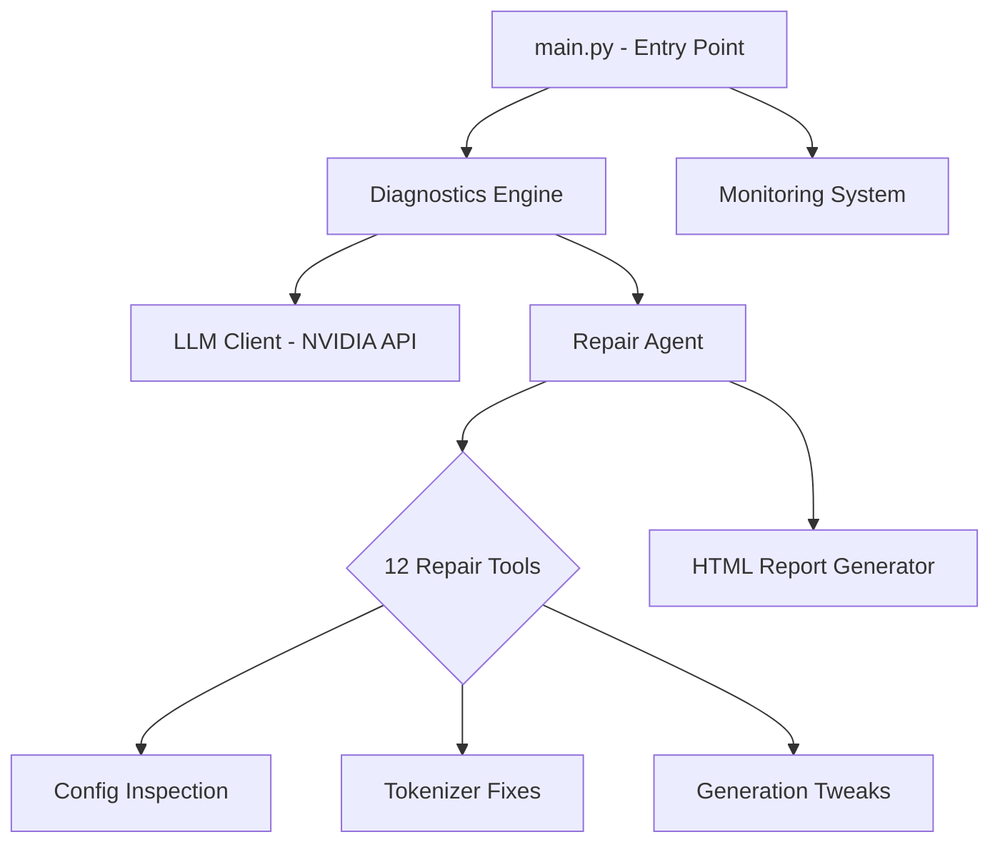

<div align="center">


  <h1>🩺 LLM Doctor</h1>
  <p><b>AI Model Diagnostics, Repair & Monitoring System</b></p>
  <p><i>Powered by NVIDIA Llama-3.3-Nemotron-Super-49B</i></p>

  <p>
    
    
    
    
  </p>
</div>

---

## 📖 Overview

**LLM Doctor** is a complete, intelligent toolset for diagnosing, repairing, and continuously monitoring Large Language Models. Built for deep, layer-by-layer neural inspection, it moves beyond superficial reporting to offer a hands-on, automated diagnostic pipeline.

If your LLM is suffering from memory collapse, repetitive generation, context amnesia, or loss spikes during training, LLM Doctor will pinpoint the root cause and securely fix misconfigured files using an LLM-driven autonomous agent.

---

## ✨ Key Features

- **🧠 Advanced Diagnostics**: Interrogates users interactively while simultaneously performing automated deep-dives into model architecture and local files.
- **🔧 Autonomous Repair Agent**: Empowers an LLM-driven agent with **12 specialized tools** to inspect configurations, fix parameters, and test model loading without altering core model weights.
- **📈 Real-Time Monitoring**: Observe and react to training log anomalies, gradient explosions, throughput drops, and memory leaks.
- **📊 Beautiful HTML Reports**: Generates comprehensive, styled HTML reports detailing diagnosis, root causes, confidence intervals, and step-by-step repair transcripts.
- **🛡️ Secure Operations**: Automatic backups before any changes. Never modifies `.safetensors` or `.bin` weight files directly—only configurations.

---

## 🚀 Quick Start

### 1. Prerequisites
Ensure you have Python 3.10+ installed. Grab your NVIDIA API Key (you will need it for the Nemotron LLM operations).

### 2. Installation
```bash
# Clone the repository
git clone https://github.com/Mohamed2007Sarhan/llm-doctor.git
cd llm-doctor

# Install the required dependencies
pip install openai rich transformers torch safetensors
```

### 3. Configuration
Add your API key to **`core/llm_client.py`**:
```python
NVIDIA_API_KEY = "your-nvidia-api-key-here"
BEST_MODEL = "nvidia/llama-3.3-nemotron-super-49b-v1"
```

### 4. Run the Pipeline
```bash
python main.py
```

---

## 🩺 System Modes

| Mode | Description |
|------|-------------|
| 🧬 **Full Diagnostic & Repair** | **(Recommended)** Interactive intake → Auto-generation of targeted questions → Analysis → Autonomous Repair Agent → HTML Report. |
| 📊 **Monitoring Only** | Live tailing of training logs. Alerts for gradient divergence or memory spikes. Optional AUTO-FIX triggers. |
| 🔄 **Load Previous Session** | Resume an earlier diagnostic trace to re-run or continue repairs. |
| ⚡ **Quick Health Check** | Rapid scan of model `config.json` and file integrity without an interview. |

---

## 🏗️ Architecture & Tools



### Available Repair Tools
The AI agent is equipped with the following system-level tools:

| Tool | Action |
|------|--------|
| `inspect_model_config` | Reads `config.json`, checking for missing or malformed fields. |
| `inspect_model_files` | Checks file presence and detects corrupt files. |
| `check_tokenizer_config` | Inspects tokenizer dictionary and special tokens. |
| `validate_weights_integrity` | Verifies binary files aren't corrupted. |
| `fix_config_field` | Direct write access to correct config values. |
| `fix_tokenizer_field` | Direct write access to correct tokenizer parameters. |
| `add_missing_config_field` | Appends missing critical fields required for loading. |
| `backup_model_config` | Securely zips and backs up configurations. |
| `restore_from_backup` | Rolls back changes to the last stable state. |
| `test_model_loading` | Dry-runs standard model initialization. |
| `check_generation_params` | Validates text generation boundaries (`generation_config.json`). |
| `fix_generation_config` | Corrects problematic sampling or generation parameters. |

---

## 📡 The Monitoring Engine

When running in **Monitor Mode**, the engine tracks standard JSON log lines or raw text logs for metrics that signify model collapse or hardware issues.

**Tracked Metrics:**
- **Loss**: Divergence, sudden spikes, or stagnation.
- **Gradients**: Norm explosions (`>100`) and vanishing gradients (`<1e-7`).
- **GPU Activity**: Usage thresholds and memory bottlenecks.
- **Throughput**: Identification of sudden `tokens/sec` drops.

**Example Input Format:**
```json
{"step": 100, "loss": 2.34, "lr": 1e-4, "grad_norm": 0.8, "throughput": 2500}
```

---

## 🔒 Safety First
LLM Doctor is designed to be **non-destructive**. 
- It actively backs up `config.json`, `generation_config.json`, and `tokenizer_config.json`.
- It dynamically prompts for permissions before making directory writes (unless overridden by Auto-Fix).
- It fundamentally restricts itself from modifying base-weight binaries.

---

<div align="center">
  <b>Built for the AI Engineering Community</b>
</div>
